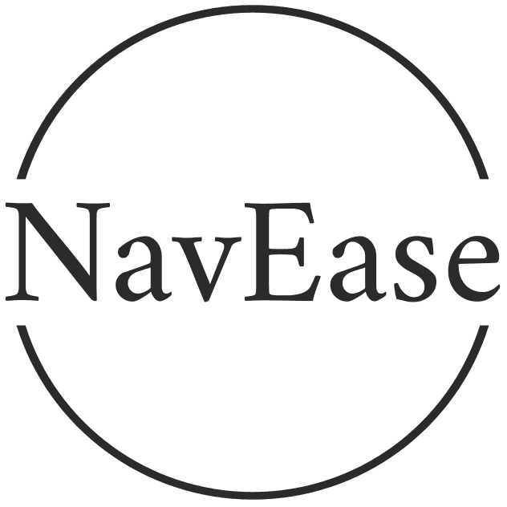

# NavEase: Keyword-based URL Redirection

<p align="center">
  
</p>

## Introduction
NavEase is a Chrome extension that simplifies your browsing by allowing you to set up custom keywords for quick URL navigation. Instead of typing full URLs, you can use short, memorable keywords to reach your favorite websites instantly.

## Features
- Custom Keyword-Based URL Redirection: Set keywords for your favorite websites and navigate with ease.
- Easy Configuration: Configure the server URL containing your keyword-URL mappings via a simple popup interface.
- Keyword Suggestions: Get suggestions based on partial keyword inputs.
- Privacy-Friendly: NavEase stores configuration locally, ensuring your data remains private.

## Installation Guide
### Step 1: Download and Install

- Visit the NavEase Chrome Web Store page.
- Click on “Add to Chrome”.
- Confirm the installation by clicking “Add extension”.

### Step 2: Install NavEase Application to manage your private url

- Build Locally
```
docker build -t navease-app .
```
- Run below docker command to install (You can setup same on Kubernetes as well)
```
docker run --name navease-app -d -it  -e 'SECRET_KEY=some_secret' -v /usr/local/data/:/app/instance/ akhileshsre/navease-app:latest
```
- Configure endpoint for the hosted Navease application, in this case

http://localhost:8080

- Open the URL and login with “admin/admin”

- First time login will ask to reset password, provide strong password

### Step 3. Configure NavEase Chrome Extension

- Click on the NavEase icon in your Chrome toolbar.
- A popup will appear, prompting you to enter the server URL, username, and password.
- Ensure to provide the new password that was set during the initial login.
- Click “Login” to authenticate the URL.

## Complete Usage Guide

- [Medium Documentation](https://medium.com/@akhilesh0.id/welcome-to-navease-your-ultimate-chrome-extension-for-quick-url-navigation-e06ae21262b2)
- [Hashnode Documentation](https://navease.hashnode.dev/unlock-seamless-browsing-define-search-keys-for-instant-url-redirection-with-navease-chrome-extension)
- [Youtube](https://youtu.be/z_k4ilvMVB8)
## License

This project is licensed under the Apache License, Version 2.0. You may obtain a copy of the License at

[http://www.apache.org/licenses/LICENSE-2.0](http://www.apache.org/licenses/LICENSE-2.0)

Unless required by applicable law or agreed to in writing, software distributed under the License is distributed on an "AS IS" BASIS, WITHOUT WARRANTIES OR CONDITIONS OF ANY KIND, either express or implied. See the License for the specific language governing permissions and limitations under the License.
